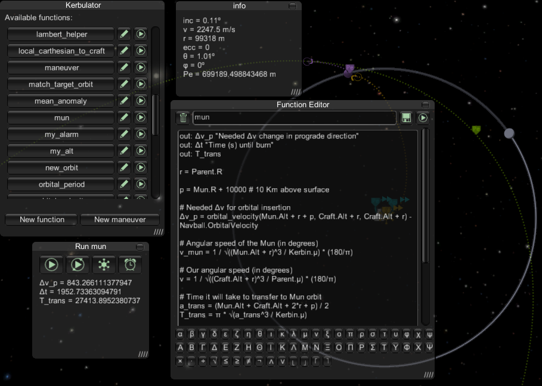

Kerbulator
==========

Kerbulator is a mod for [Kerbal Space Program](http://www.kerbalspaceprogram.com) (KSP). It adds a powerful calculator you can use during flight. It allows you write mathematical functions, execute them and create maneuver nodes based on the results. It uses an expression language which is unicode aware, so your formulae can be a little more readable than traditional programming code.

Kerbulator comes without any preprogrammed formulae. While it can be fun to use [someone else's math](https://github.com/MuMech/MechJeb2), the point of Kerbulator is to enable you to learn and discover on your own.

What you get is access to all the numbers you can read off the various displays in vanilla KSP, an astronomical almanac and a simple expression language to write functions operating on them. This enables you to calculate useful stuff like Hohmann transfers, gravitational slingshots, launch windows, etc. Kerbulator can also create maneuver nodes for you based on your calculations.

## Installation
The installation of Kerbulator is the same as for most other mods. Install Kerbulator by downloading the [zip file](https://github.com/wmvanvliet/Kerbulator/releases/download/0.44/Kerbulator-0.44.zip) and unzipping it into the `GameData` folder of your KSP installation. The `GameData` folder should now contain a subfolder called `Kerbulator`. Start KSP and you're good to go!

## Download latest release
[Hosted on Github](https://github.com/wmvanvliet/Kerbulator/releases/download/0.44/Kerbulator-0.44.zip)  
[Hosted on SpaceDock](http://spacedock.info/mod/782/Kerbulator)  
[Hosted on Curse](http://www.curse.com/ksp-mods/kerbal/220266-kerbulator)

## Usage
[Manual](doc/manual.mkd)  
[Language reference](doc/langref.mkd)  
[Globals](doc/globals.mkd)  

## Start learning KSP math

[My own notes] (https://www.dropbox.com/s/a09gle65k7ghei6/space.pdf?dl=1)  
[Scott Manley video #1] (http://www.youtube.com/watch?v=000zDI2nmq8)  
[Scott Manley video #2] (http://www.youtube.com/watch?v=QXPhQKkOcYM)  

